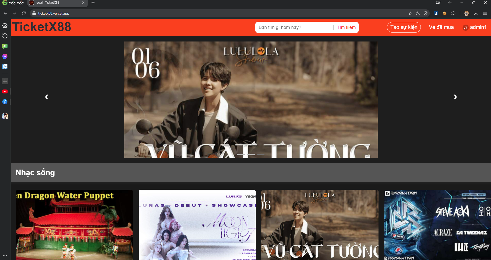
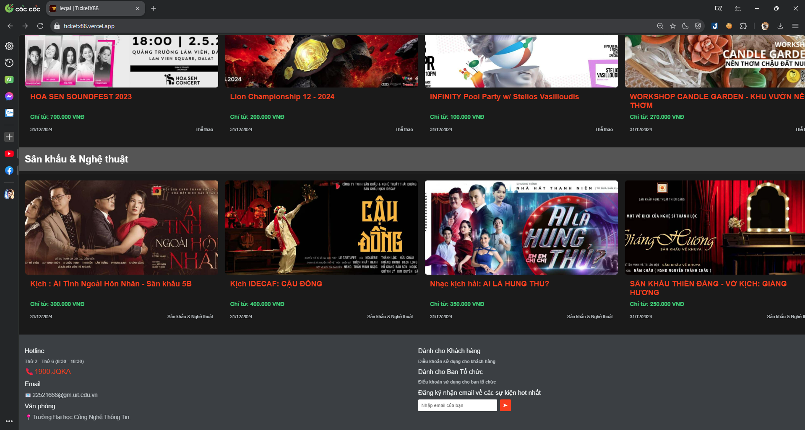
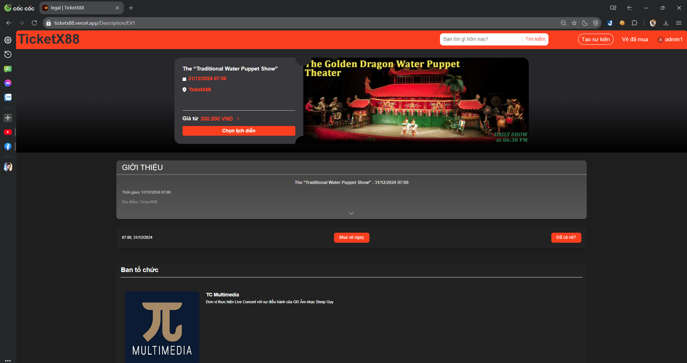
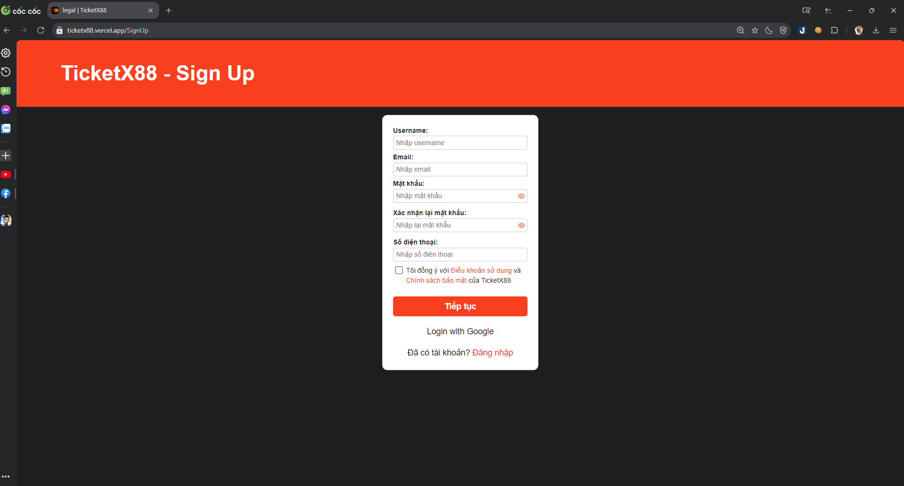
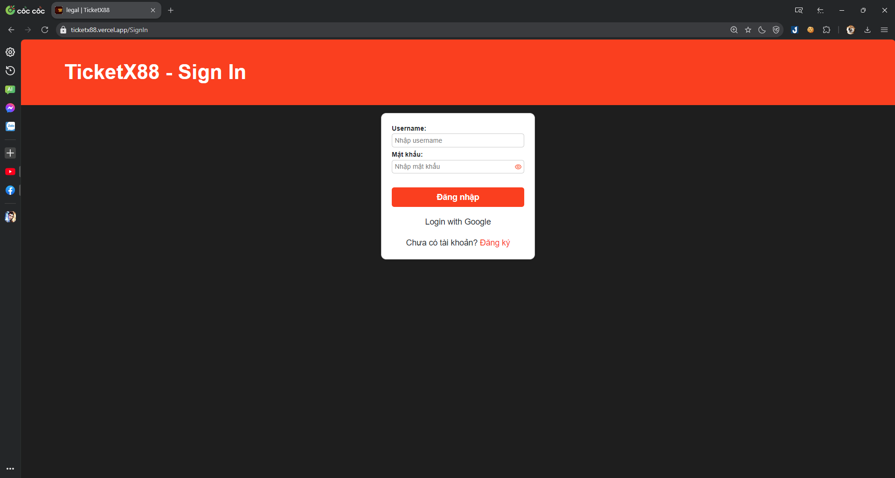
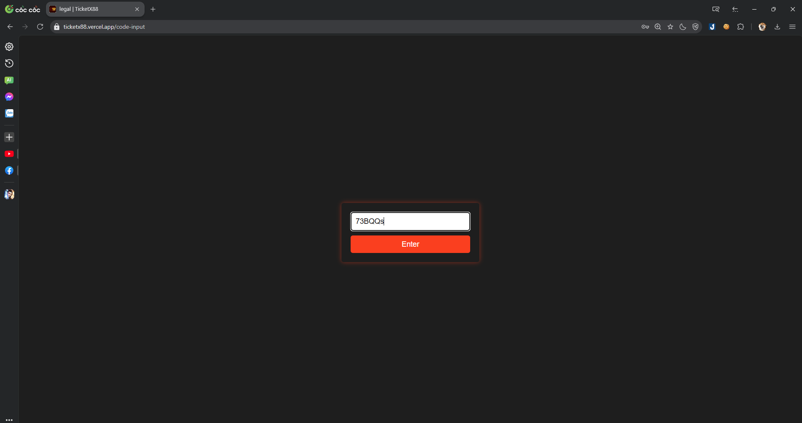
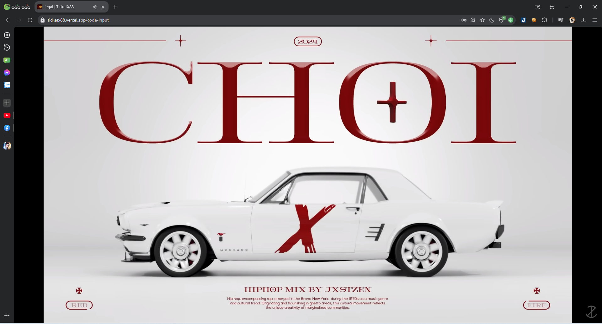

# Đồ án môn học NT208

## Tên trang web: TicketX88
### Nội dung: Đây là trang web bán vé và xem concert

## 1. Sơ đồ website

## 2. Các tính năng trang web
### Tính năng cơ bản
* Đăng ký / Đăng nhập
    - Nhập thông tin người dùng
* Đăng nhập bằng Google
* Tạo sự kiện
    - Nhập thông tin sự kiện
        - Banner
        - Logo BTC
        - Thông tin cơ bản
        - Miêu tả sự kiện
        - Giá vé
* Mua vé sự kiện
    - Giao diện mua vé bao gồm những thông tin BTC nhập khi tạo sự kiện và tính năng nhập code nếu đã mua vé
    - Cung cấp mã vé cho người dùng
* Xem video sự kiện
    - Nhập mã vé đã mua để xem
    - Mỗi mã vé chỉ có thể sử dụng bởi account đã mua vé đó
    - Mã vé của mỗi account là duy nhất
* Tìm kiếm sự kiện
    - Đề xuất kết quả khi tìm kiếm
    - Hiển thị danh sách các sự kiện có chứa nội dung tìm kiếm
### Tính năng nâng cao
- AJAX (Tại trang chủ)
- Auto Complete (Tại thanh tìm kiếm)
- Không thể đăng nhập 1 account ở 2 thiết bị

## 3. Hình ảnh trang web
### Trang chủ

### Thông tin chi tiết sự kiện

### Trang đăng nhập/đăng kí

### Nhập mã vé và xem sự kiện

## 4. Hướng dẫn cài đặt:
### Cài đặt Nodejs và npm
#### Truy cập đường link [Nodejs](https://nodejs.org/en/) để cài Nodejs

### Clone Reposistory:

#### `git clone https://github.com/SPRINGPEACHVINH/NT208.git`

### Check out sang branch frontend để chạy các lệnh sau

### Tải các packages cần thiết:

#### `npm i react-scripts`

### Lệnh launch project local:

#### `npm start`

Mở [http://localhost:8080](http://localhost:8080) để xem trên trình duyệt.

Trang sẽ tự reload khi sửa code.
